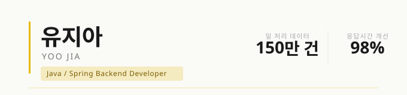

## 유지아 · Java/Spring 백엔드 개발자

일 150만 건 데이터 처리, 조회 응답시간 98% 개선 등  
실제 운영 환경에서 구조적 문제를 직접 설계하고 해결한 경험을 강점으로 삼고 있습니다.  
스마트팩토리 MES, SCADA 연동, 농협 APC 시스템 등 다양한 산업 도메인에서  
이기종 장비 연동부터 대용량 데이터 처리까지 폭넓은 백엔드 개발을 경험했습니다.

---

## 🛠 Tech Stack

**Backend**  

**Database**  

**Frontend**  

**Infra / Tools**  

---

## 📂 실무 프로젝트

| 프로젝트 | 기간 | 주요 성과 |
|---|---|---|
| [한반도농협 스마트 APC 시스템](https://github.com/jia-yoo/smart-apc-system) | 2025.05 – 2025.10 | 특허 출원 · aT 디지털 전환 선도모델 선정 · 일 150만 건 처리 |
| [광우 MES-SCADA 연동 시스템](https://github.com/jia-yoo/mes-scada-integration-system) | 2025.08 – 2025.12 | 조회 응답시간 98% 개선 · 데이터 누락 0건 |
| [신성산업 스마트팩토리 MES](https://github.com/jia-yoo/smartfactory-mes-system) | 2025.08 – 2026.03 | 사내 최초 웹 기반 현장 프로그램 구축 · 이후 표준 구조 채택 |

---

## 🏅 자격증

- 정보처리기사 (2024.09)
- SQL개발자 SQLD (2024.12)
- 리눅스마스터 2급 (2025.10)

---

## 📊 GitHub Stats

---

📬 jiayoo.dev@gmail.com · [Portfolio](https://jia-yoo.github.io)
